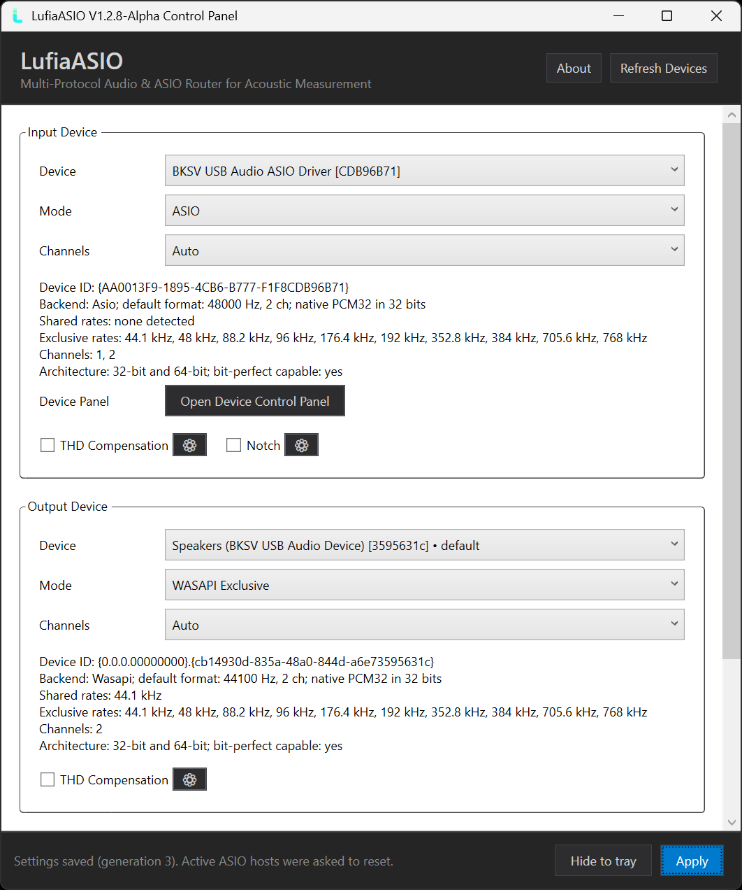
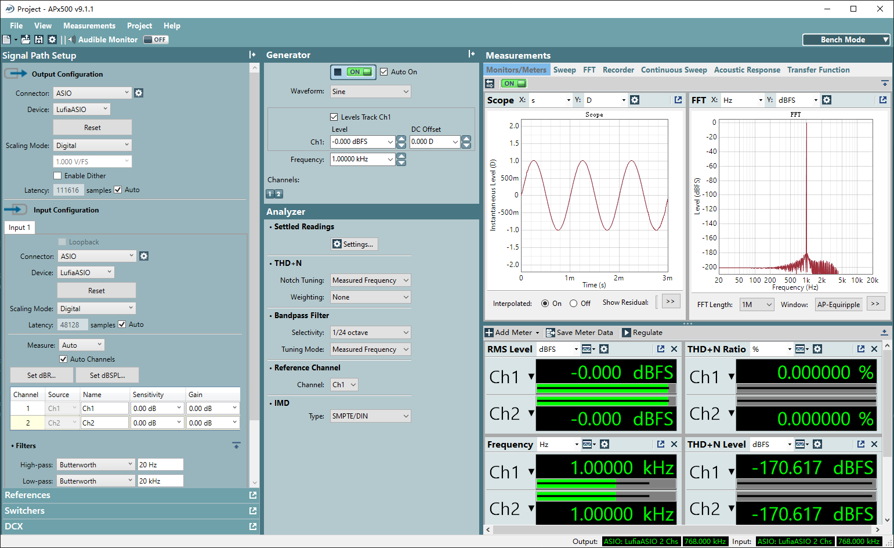
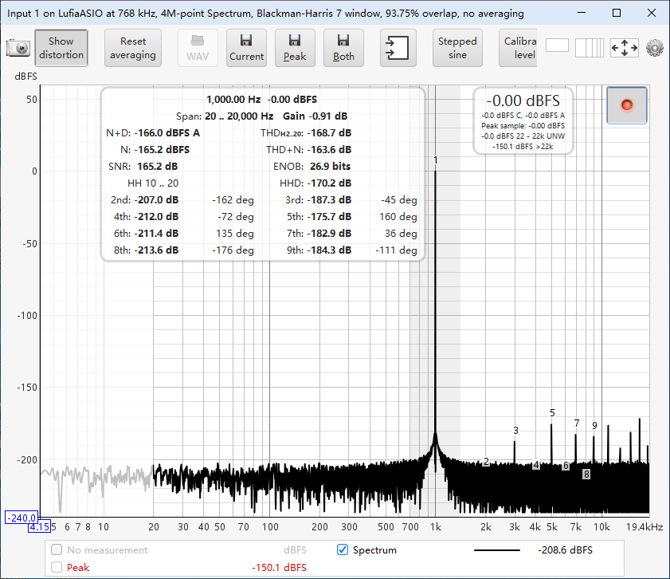
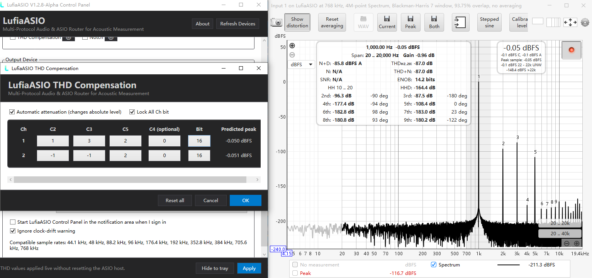
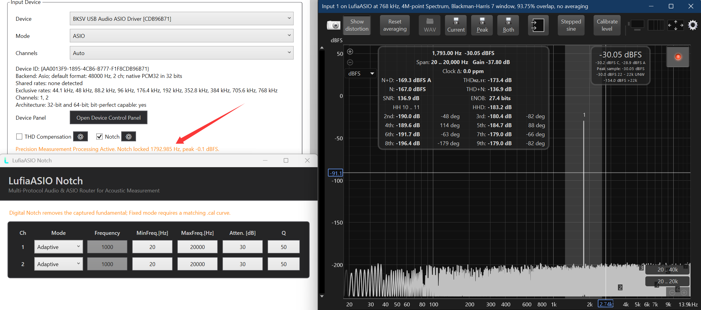

# LufiaASIO

## One ASIO driver. Five Windows audio backends.<br>Any input-to-output combination.

**Installers are available on the [GitHub Releases page](https://github.com/aspirinkisalol/LufiaASIO-Release/releases).**

LufiaASIO is a multi-protocol audio router built for acoustic and electronic-audio measurement as well as personalized Hi-Fi playback. Beyond measurement-grade routing, its non-EQ THD Compensation can reshape the balance of even- and odd-order harmonics for a distinctive tube-like, transistor-like, or custom sonic character—without using a conventional equalizer to alter the frequency-response curve. LufiaASIO presents one familiar ASIO device to your measurement or playback software, then lets you choose the actual input and output devices independently—even when they use different Windows audio protocols or different native ASIO drivers.

**Connect the hardware you already own. Keep the software you already know. Let LufiaASIO bridge the gap.**

> **LufiaASIO 1.2.8 Alpha** is a preview release intended for evaluation and measurement-lab testing. Verify every critical measurement against a known reference before relying on it for production results.

<div align="center">
  
</div>

## Why LufiaASIO?

- **A true 5 × 5 audio-routing matrix** — independently combine WASAPI, MME, DirectSound, WDM-KS, and native ASIO for input and output.
- **Native-ASIO aggregation** — use one ASIO interface in the host while capturing from one native ASIO driver and playing through another.
- **Native WASAPI Exclusive beyond the Windows GUI list** — LufiaASIO probes the endpoint driver directly instead of limiting the host to the sample rates shown in Windows Sound device properties. On hardware that accepts it, LufiaASIO can expose native rates up to **1,536 kHz / 32-bit PCM** with bit-perfect sample transport when measurement compensation is disabled.
- **Made for measurement applications** — designed around Audio Precision APx, Listen SoundCheck, Room EQ Wizard (REW), and other ASIO-capable test tools.
- **Measurement Compensation built into the route** — per-channel polynomial THD Compensation and an Adaptive/Fixed digital Notch help reveal distortion and residual noise that may otherwise be hidden by the measurement chain.
- **Stable device recall** — settings are tied to each backend's native device ID, not a potentially duplicated or corrupted display name.
- **Wide buffer range** — host buffers from 512 to 1,048,576 frames support both responsive monitoring and long, sustained High-load measurement sessions.
- **32-bit and 64-bit host support** — the x64 installer registers both x64 and x86 ASIO drivers on 64-bit Windows.

## Break out of the single-driver box

Most ASIO hosts expect one driver to own both input and output. That becomes a problem when the best ADC and DAC use different drivers, when a measurement application supports ASIO but your target device exposes only WASAPI, or when a legacy interface must be connected to a modern test chain.

LufiaASIO makes input and output independent:

| Input ↓ / Output → | WASAPI | MME | DirectSound | WDM-KS | Native ASIO |
|---|:---:|:---:|:---:|:---:|:---:|
| **WASAPI** | ✓ | ✓ | ✓ | ✓ | ✓ |
| **MME** | ✓ | ✓ | ✓ | ✓ | ✓ |
| **DirectSound** | ✓ | ✓ | ✓ | ✓ | ✓ |
| **WDM-KS** | ✓ | ✓ | ✓ | ✓ | ✓ |
| **Native ASIO** | ✓ | ✓ | ✓ | ✓ | ✓ |

WASAPI adds three operating choices—Auto, Exclusive, and Shared—while every side keeps its own device and channel selection. **WASAPI Exclusive is the native Windows exclusive mode shown in the Sound control panel's device properties, not a proprietary emulation.** LufiaASIO addresses that native interface directly and can request formats beyond the control panel's displayed list. This creates up to 25 backend pairings before individual devices and WASAPI modes are considered.

The actual combinations available depend on the installed hardware, its supported formats, and whether the vendor driver permits simultaneous access. LufiaASIO reports an unsupported route instead of silently switching to a different API.

### Native WASAPI Exclusive without the 384 kHz GUI ceiling

The Windows Sound control panel may stop listing Default Format choices at 384 kHz even when the endpoint driver supports more. That list is a user-interface boundary, not necessarily the device's native limit. LufiaASIO probes the driver through Windows' native WASAPI Exclusive format negotiation and exposes every accepted rate in its own supported-rate list, including **705.6 kHz, 768 kHz, 1,411.2 kHz, and 1,536 kHz** when the device truly supports them.

On a compatible PCM32 endpoint, this enables an ASIO host to use native **1,536 kHz / 32-bit PCM bit-perfect transport** through the same Windows exclusive-mode interface—without editing Windows, replacing the device driver, or resampling a lower-rate stream. Unsupported formats remain unavailable and are never simulated.

Ultra-high sample rates are especially useful for wideband and time-domain measurement. For a fixed FFT length, 1,536 kHz supplies samples four times as quickly as 384 kHz: a 1,048,576-point acquisition window contains about **0.683 seconds** of data instead of **2.731 seconds**. This can make live FFT displays update sooner, extend observable bandwidth, and provide finer time-domain sample spacing. Higher sample rate does not by itself improve converter linearity, amplitude accuracy, or Hz-per-bin resolution; those still depend on the hardware, calibration, FFT length, window, and measurement method.

### Bit-perfect paths, clearly defined

For a compatible native integer format, **WASAPI Exclusive** and **native ASIO** can provide bit-perfect transport through LufiaASIO. WASAPI Exclusive remains bit-perfect-capable even when LufiaASIO requests a device-native rate above the Windows control panel's 384 kHz display ceiling, up to 1,536 kHz where accepted by the endpoint. WDM-KS can also be bit-perfect-capable when the native integer format and sample rate match.

MME, DirectSound, WASAPI Shared, floating-point conversion, and any route involving Windows format conversion are compatibility paths and are not advertised as bit-perfect. Enabling THD Compensation or Notch intentionally changes sample values; disable all measurement compensation when performing a bit-perfect transport test.

## Built for measurement workflows

### Audio Precision APx — bring Windows endpoints into an ASIO-only workflow

Select **LufiaASIO** as the APx input and output connector, then route either side to WASAPI Exclusive, WDM-KS, or a native ASIO device. This gives APx access to Windows endpoints that it cannot address directly through WASAPI while retaining an ASIO workflow and bit-perfect-capable transport on eligible routes. A capable WASAPI Exclusive endpoint can also expose its driver-native high rates to APx beyond the 384 kHz choices visible in Windows Sound device properties, up to 1,536 kHz / PCM32 when supported.

<div align="center">
  
</div>

*Example: a 768 kHz digital-loopback route in APx500. Based on a BKSV physical audio I/O loopback bridge developed on XMOS. Displayed results belong to the test setup shown and are not a guaranteed specification for other hardware.*

### Room EQ Wizard — mix interfaces without giving up ASIO

REW normally expects the selected ASIO driver to provide both directions. LufiaASIO lets REW use, for example, the input channels from one native ASIO interface and the output channels from another—or combine native ASIO capture with native Windows WASAPI Exclusive playback, including endpoint-supported rates above the Windows GUI's 384 kHz list.

Its packet aggregation and splitting logic decouples the host's ASIO block from each backend's native packet size. Large FFT and recording buffers remain usable without forcing the hardware driver to adopt the same block size. At an equal FFT length, a genuinely supported ultra-high sample rate fills each acquisition window sooner, enabling a more responsive live spectrum while capturing a wider measurement bandwidth.

<div align="center">
  
</div>

*Example: a 768 kHz digital-loopback route in REW. Based on a BKSV physical audio I/O loopback bridge developed on XMOS. Displayed results belong to the test setup shown and are not a guaranteed specification for other hardware.*

### Listen SoundCheck — routing flexibility for sustained test sequences

LufiaASIO's composite engine is designed for continuous callback workloads, mismatched native packet sizes, and long-duration operation. That makes it useful when SoundCheck sequences must connect equipment exposed through different Windows APIs or keep running with a deliberately large host buffer.

## Precision measurement processing

The processing controls appear only on **native ASIO** and **WASAPI Exclusive** routes. Every profile is saved by backend, direction, mode, stable device ID, and channel, so reconnecting a known device restores its own measurement settings without repeated manual setup.

### Per-channel THD Compensation for bit-perfect measurement chains

LufiaASIO applies a signed polynomial correction independently to every enabled input or output channel.

- Tune C2, C3, C4, and C5 per channel; zero coefficients are skipped.
- Select 16- to 32-bit coefficient resolution for fine or coarse adjustment.
- Preview coefficient changes live while the ASIO stream remains open.
- Use optional Automatic Attenuation when clipping protection is more important than retaining absolute level.
- Monitor the predicted peak and clipping warning before accepting a measurement.

This fixed-point, sample-aware processing can be used to counter repeatable converter harmonics in a calibrated measurement chain. It can also be used experimentally to reshape the balance of even- and odd-order harmonics—toward warmer, tube-like or more restrained, transistor-like voicing—without applying a conventional EQ curve.

<div align="center">
  
</div>

> THD Compensation uses device-specific calibration to achieve optimized distortion correction. Coefficients are tailored for each device, channel, level, load, and measurement setup to ensure accurate and repeatable results.

### Adaptive and Fixed digital Notch

The input-side digital Notch suppresses the captured fundamental so low-level harmonics and residual noise are easier to inspect.

- **Adaptive mode** searches within a user-defined frequency range, locks to the detected fundamental, and tracks it automatically.
- **Fixed mode** uses a manually entered frequency, attenuation, and Q for repeatable single-frequency work.
- Per-channel settings support independent capture paths.
- Live lock status exposes the tracked frequency instead of hiding the detector state.

<div align="center">
  
</div>

> The digital Notch changes captured data and must be included in the measurement method. Fixed mode may require a matching calibration curve when absolute residual response is important.

## Engineered for real devices, not ideal diagrams

- Input and output sample-rate support is checked independently; a route opens only when every enabled side supports the requested rate.
- Native packets are aggregated or split without forcing the outer ASIO buffer size onto the downstream device.
- Integer ASIO, WDM-KS, and compatible WASAPI Exclusive PCM32 paths use lossless 32-bit-aligned queues.
- The real-time callback path performs no heap allocation, registry access, file I/O, or UI work.
- FIFO underflow, overflow, discontinuity, callback, frame, and maximum-watermark diagnostics are available from the control panel.
- Same-driver ASIO duplex shares one native driver instance. Two different ASIO devices are loaded independently when their vendor drivers allow it.
- Device selections survive non-ASCII names, duplicate names, enumeration-order changes, and system restarts because names are used only for display.

## Quick start

### 1. Install the correct package

- **64-bit Windows 10 or Windows 11:** install `LufiaASIO-1.2.8-x64.msi`. It includes both 64-bit and 32-bit ASIO registration for modern and legacy hosts.
- **32-bit Windows:** install `LufiaASIO-1.2.8-x86.msi`.

The control panel is self-contained; no separate .NET Runtime installation is required. Administrator permission is required to install the ASIO driver registration.

Download installers only from the official LufiaASIO release page and verify the accompanying SHA-256 file before installation:

- [LufiaASIO 1.2.8 x64 SHA-256](LufiaASIO-1.2.8-x64.msi.sha256)
- [LufiaASIO 1.2.8 x86 SHA-256](LufiaASIO-1.2.8-x86.msi.sha256)

```powershell
Get-FileHash .\LufiaASIO-1.2.8-x64.msi -Algorithm SHA256
Get-Content  .\LufiaASIO-1.2.8-x64.msi.sha256
```

### 2. Select LufiaASIO in the host

Open your application’s audio-device settings and choose **LufiaASIO** as its ASIO driver. Open the LufiaASIO control panel from the host, the Start menu, or the notification-area icon.

### 3. Build the route

For both **Input Device** and **Output Device**:

1. Select the Mode.
2. Select the Device.
3. Select the required channel count.
4. Open the vendor Device Control Panel when a native ASIO driver needs additional configuration.
5. Click **Apply**, then allow the host to reset or reselect its channels if requested.

Start with measurement compensation disabled. Confirm the route, sample rate, channel order, and level first; then enable THD Compensation or Notch only when the measurement method calls for it.

### 4. Choose a practical buffer

A larger buffer improves scheduling margin but increases latency. Begin at 2,048 or 16,384 frames for measurement work, then move lower for responsiveness or higher for very large FFT/recording workloads. LufiaASIO supports 512 through 1,048,576 frames, but the best value depends on the host, sample rate, channel count, and downstream drivers.

## Important clocking note

LufiaASIO **avoids adaptive sample-rate conversion** to preserve **bit-perfect** audio data for accurate measurements. When input and output come from different or unconfirmed physical clocks, the route operates through a best-effort FIFO. Even when both devices display the same nominal sample rate, their clocks can drift and eventually cause an underflow or overflow.

For long synchronized measurements, use devices that share word clock, a common digital clock, or another confirmed hardware synchronization method. Hiding the clock-drift warning changes only the display; it does not synchronize the devices.

## Current Alpha boundaries

- DSD is not supported; PCM is required.
- MME and DirectSound may use Windows conversion and are intended for compatibility, not bit-perfect measurement.
- WASAPI Shared runs at the Windows Mix Format rate.
- A vendor ASIO driver may refuse a second instance or simultaneous access through another API.
- Native ASIO channel selection currently uses the first enabled channels rather than an arbitrary channel-routing matrix.
- Measurement compensation is available only for bit-perfect native ASIO and WASAPI Exclusive.
- This Alpha should be independently validated before use in compliance, certification, or production pass/fail testing.

## Troubleshooting

**The host cannot see LufiaASIO**  
On 64-bit Windows, install the x64 MSI—it registers both x64 and x86 ASIO components. Restart the host after installation.

**The MSI remains on the Status page for an unusually long time**  
LufiaASIO includes the .NET Runtime required by its self-contained control panel, so the installer is larger and may take longer to copy, verify, or scan than a typical ASIO driver package. Wait a few minutes, especially on a slower disk or while antivirus scanning is active. If the installer still shows no progress, cancel or close it normally, allow Windows Installer to finish any rollback, then start the MSI again. Do not forcibly terminate `msiexec.exe` while installation or rollback is still in progress.

**A route refuses the requested sample rate**  
Every enabled side must support the exact rate. WASAPI Shared accepts only the current Windows Mix Format rate. Check the device details in the control panel and the downstream ASIO driver's own panel.

**Two native ASIO devices do not open together**  
Some vendor drivers allow only one process-global instance. Close other audio applications and retry. If the vendor still rejects parallel loading, use a different backend for one side where appropriate.

**The audio breaks up during a long test**  
Increase the ASIO buffer and inspect the FIFO underflow/overflow counters. If the counters continue to rise with two independent devices, synchronize their hardware clocks.

**A THD or Notch result looks unexpectedly better—or worse**  
Disable all measurement compensation and repeat the baseline. Confirm level, channel, frequency, calibration, and coefficient profile before treating the processed result as valid.

## Author and feedback

LufiaASIO is created and maintained by **Aspirin** ([@aspirinkisalol](https://github.com/aspirinkisalol)), an acoustic engineer with a focus on practical audio measurement workflows.

For an Alpha issue report, include:

- LufiaASIO version and Windows version
- Host application and whether it is 32-bit or 64-bit
- Input/output Mode, device, sample rate, channels, and buffer frames
- Whether THD Compensation or Notch was enabled
- FIFO diagnostics and exact error text
- Reproduction steps, plus a crash dump when the host terminates unexpectedly

Do not publish private device data or proprietary test material in a public report.

## Steinberg ASIO licensing and trademark notice

<p align="center">
  
</p>

LufiaASIO was developed using the Steinberg ASIO SDK 2.3.4 under the applicable SDK terms accepted by the distributor. The Steinberg ASIO SDK itself is not included in this binary release.

ASIO is a registered trademark of Steinberg Media Technologies GmbH. Use of the ASIO name and compatibility logo follows Steinberg's ASIO usage guidelines. LufiaASIO is an independent project and is not affiliated with, sponsored by, or endorsed by Steinberg Media Technologies GmbH.

Audio Precision and APx are trademarks or registered trademarks of Audio Precision, Inc. SoundCheck is a trademark of Listen, Inc. Room EQ Wizard and other product names belong to their respective owners. They are referenced only to describe intended interoperability; no affiliation or endorsement is implied.

---

**Route without compromise. Measure with context. Build the Windows audio chain your bench actually needs.**
